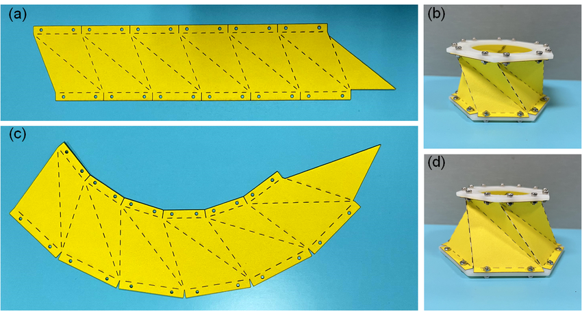

# Modeling and Inverse Design of Kresling Origami Structures Using Machine Learning

> Graduation Thesis – School of Mechanical Engineering, Hanoi University of Science and Technology
> \*\*Students:\*\* Nguyen Duc Thu, Vuong Thanh Trung
> \*\*Supervisors:\*\* Dr. Thai Phuong Thao, Dr. Truong Quoc Chien

<p align="center">
  
</p>

\---

## 1\. Overview

**Kresling origami** structures show great potential for soft robotics, vibration isolation, and other advanced engineering applications, thanks to their ability to flexibly tune dynamic characteristics purely through geometry. However, the strong nonlinear coupled translation–twist deformation mechanism of the Kresling structure makes the **inverse design** problem — going from a desired dynamic response (natural frequency *f*, damping ratio *ζ*) back to the underlying geometric parameters (base radius *R₁*, top radius *R₂*, height *H*, twist angle *θ*, number of sides *N*) — very difficult to solve with classical analytical or optimization methods, due to non-uniqueness of solutions and the high cost of simulation.

This thesis builds a **machine-learning-based inverse design framework**, combining:

* A nonlinear **bar–hinge model**, whose equations of motion are solved with the **4th-order Runge–Kutta method**, used to generate a large simulation dataset for structures with number of sides *N* ranging from 5 to 12 (**15,004 configurations**, of which **13,642 valid samples**).
* A **feedforward neural network (FNN)** acting as a surrogate model, quickly predicting the dynamic response from a given set of geometric parameters.
* A **Conditional Variational Autoencoder (CVAE)** generative model, producing multiple geometric solutions that satisfy the same target dynamic response.

Three CVAE variants were studied to evaluate different ways of handling the number-of-sides variable *N* (design variables: *R₁, R₂, H, θ, N*; condition variables: *f, ζ*, optionally including *N*):

|Variant|Handling of *N*|
|-|-|
|**Baseline model**|*N* is fixed in advance and not part of free training|
|**CVAE-Nfree**|*N* is treated as a free design variable, together with *R₁, R₂, H, θ*, in the latent space|
|**CVAE-Ncond**|*N* is used as a condition variable (together with *f, ζ*) to control the generation of the remaining parameters|

The framework was implemented mainly in **Python**, using **PyTorch**.

\---

## 2\. Workflow

<p align="center">
  
</p>

The diagram above summarizes the overall workflow: physical modeling (bar–hinge), generation of the simulation dataset, training of the FNN surrogate model, and the inverse design problem solved with the CVAE.

### Bar–hinge model

<p align="center">
  
</p>

The Kresling structure is discretized into a system of bars (carrying axial deformation) and hinges (carrying dihedral-angle rotation), allowing the model to capture the large, strongly nonlinear deformations that characterize the Kresling folding mechanism.

\---

## 3\. Simulation Dataset

<p align="center">
  
</p>

<p align="center">
  
</p>

<p align="center">
  
</p>

The dataset was generated by sweeping the geometric parameter space and solving the corresponding dynamic simulation, which was then used as training data for both the FNN and the CVAE models.

\---

## 4\. Dynamic Simulation Results

Results from one representative simulation case (folder `VLieu\_PE\_results/STT\_5605`):

<p align="center">
  
</p>

<p align="center">
  
</p>

**Dynamic deformation simulation video (RK4):**

<p align="center">
  <video src="https://github.com/thunguyen2144/Kresling-Origami/raw/main/VLieu\_PE\_results/STT\_5605/Kresling\_Simulation\_Zoomed.mp4" controls width="600">
    Your browser does not support inline video playback. You can watch it here instead:
    <a href="VLieu\_PE\_results/STT\_5605/Kresling\_Simulation\_Zoomed.mp4">Kresling\_Simulation\_Zoomed.mp4</a>
  </video>
</p>

**Animation (GIF) of the deformation under applied force:**

<p align="center">
  
</p>

\---

## 5\. Key Results

* The **FNN** surrogate model predicts the dynamic response with high accuracy (**R² > 0.98**): given a set of geometric parameters, the model predicts the actual dynamic behavior of the Kresling structure almost perfectly (over 98% accuracy).
* Both CVAE variants reconstruct geometry well:

  * **CVAE-Ncond** achieves the highest reconstruction accuracy.
  * **CVAE-Nfree** achieves the best physical validation results (verified through bar–hinge simulation), which best matches the design objective.
* The thesis confirms the feasibility of combining a **generative model (CVAE)** with a **surrogate model (FNN)** to significantly reduce design time compared to traditional iterative simulation approaches, opening directions for future work such as incorporating experimental validation, more detailed FEM models, and extending the approach to other origami structures.

\---

## 6\. Repository Structure

```
Kresling-Origami/
├── README.md                         # This file
├── CĐT 06.04 – 20226166.docx         # Graduation thesis report
├── Vatlieu\_PE.xlsx                   # PE material property data
├── images/                           # Figures illustrating the model and dataset
└── VLieu\_PE\_results/STT\_5605/        # Sample simulation results (images, GIF, video, raw data)
```

> \*\*Note:\*\* The source code for this thesis (hinge model, FNN training, CVAE, etc.) \*\*is not publicly available\*\* in this repository. This repository is solely for the purpose of introducing the project, its methodology, and results; it focuses on the Kresling structural dynamics simulation and does not specifically discuss reverse engineering.

\---

## 

